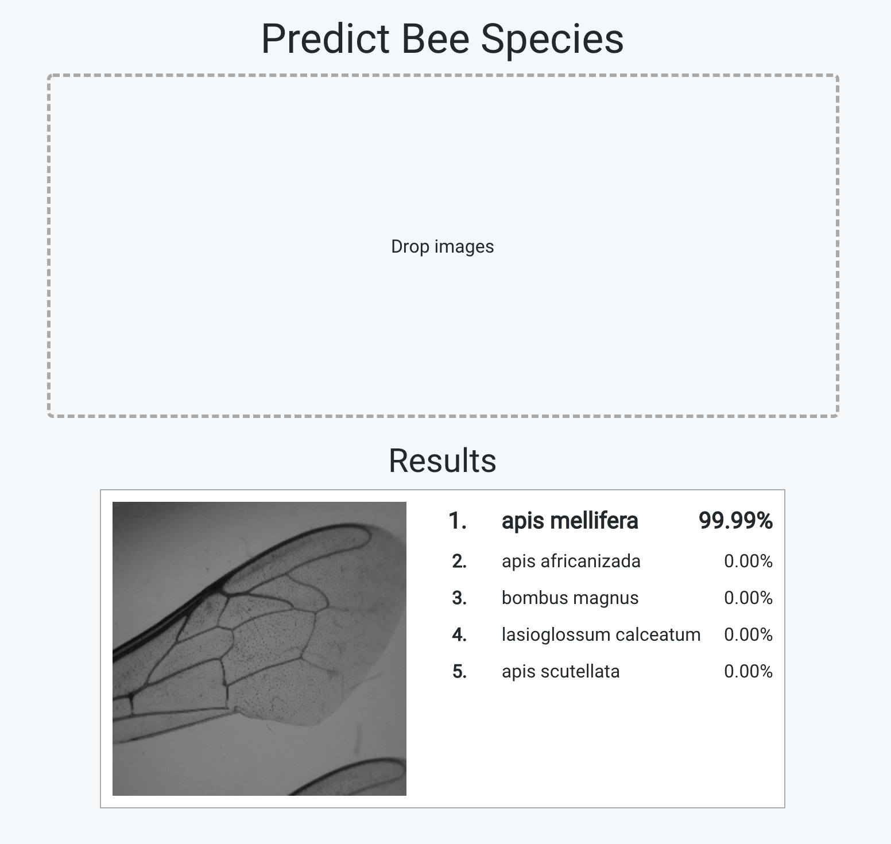

# Description
DeepABIS is a convolutional neural network trained to classify
bee species from images of wings.

# Installation
## Using Docker

### Inference service
The web version sends its classification requests to this service,
which loads up the network model, performs inferences and sends
the results back to the PHP client. So we need to install this 
first:

1. Run 
```bash
docker pull deepabis/deepabis:inference
``` 

2. Create a bridge network. Both containers need to be in the same network
to communicate with each other. By creating a user-defined network, we can
use aliases for each container instead of using IP addresses.
<br>
```bash
docker network create deepabis-network
```

3. Run the container with
 alias `inference` in our created network and expose port 9042: <br>
```bash
docker run -p 9042:9042 --net deepabis-network --network-alias inference deepabis/deepabis:inference
```

Now, our second cloud container (or native installation) will be able to reach the inference service.

### Web version

1. For a quick start, the following command pulls the 
web version as a Docker image:
<br>
```bash
docker pull deepabis/deepabis-cloud
```

2. Then, start a simple web server by running <br>
```bash
docker run -p 8000:8000 --net deepabis-network -e "INFERENCE_HOST=inference" deepabis/deepabis-cloud
``` 

This again creates a container on our custom network. 
The website can then be viewed on `localhost:8000`.

## Manually
### Inference service

0. Requirements:
<ul>
    <li>Python >= 3.5.2</li>
</ul>

1. Clone the inference repository: <br>
```bash
git clone https://github.com/deepabis/deepabis-inference && cd deepabis-inference
```

2. Install the dependencies: <br>
```bash
pip install -r requirements.txt
```

3. Run the server: <br>
```bash
python server.py
```

4. The inference service now runs on port 9042.

### Web version

0. Requirements:
<ul>
    <li> PHP >= 7.3 </li>
    <li> Composer >= 1.7 </li>
    <li> Node >= 11.0 </li>
    <li> NPM >= 6.0 </li>
</ul>

1. Clone the web repository:
<br>
```bash
git clone https://github.com/deepabis/deepabis-cloud && cd deepabis-cloud
```

2. Install PHP dependencies: <br>
```bash
composer install
```

3. Copy `.env.example` to `.env`

4. In the `.env` file, set `INFERENCE_HOST` to `localhost`.

5. Install JS dependencies: <br>
```bash
npm install
```

6. Bundle JS source code: <br>
```bash
npm run production
```

7. Run `php artisan serve` to start up a simple HTTP server on port 8000.
Alternatively, use Laravel's `valet` (macOS) or Laravel Homestead which
both come with nginx to serve the site.

8. Done!

## Installing the mobile version

0. Requirements:
<ul>
    <li> Android Studio</li>
</ul>

1. Clone the mobile repository:<br>
```bash
git clone https://github.com/deepabis/deepabis-mobile
```

2. Open the cloned directory in Android Studio

3. Click `Build > Make Project`. Gradle should synchronize 
the dependencies and build the project.

4. Run the application. For this, you need to configure a virtual device 
using the AVD manager or, alternatively, plug in a real Android device.

# Usage

## Web version

Drop any image (preferably depicting microscopic captures of 
bee wings) into the "Drop images" box. Assuming your installation
was successful, the top 5 results will then
be displayed below after a short delay.



